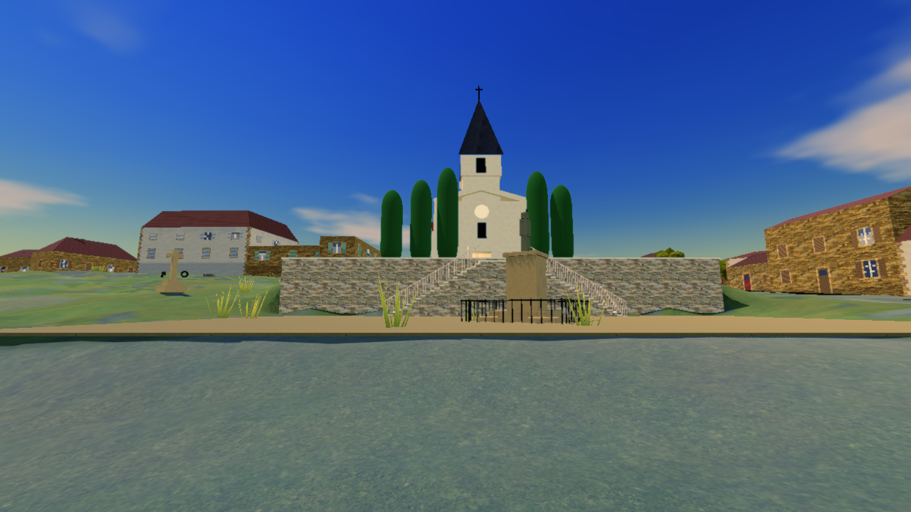
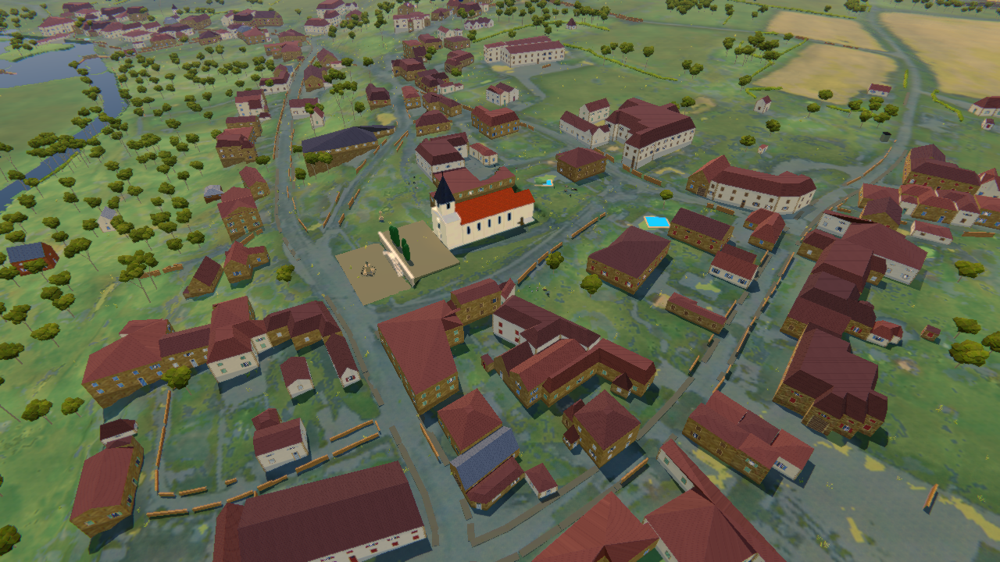
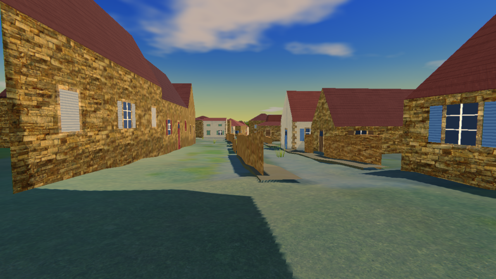
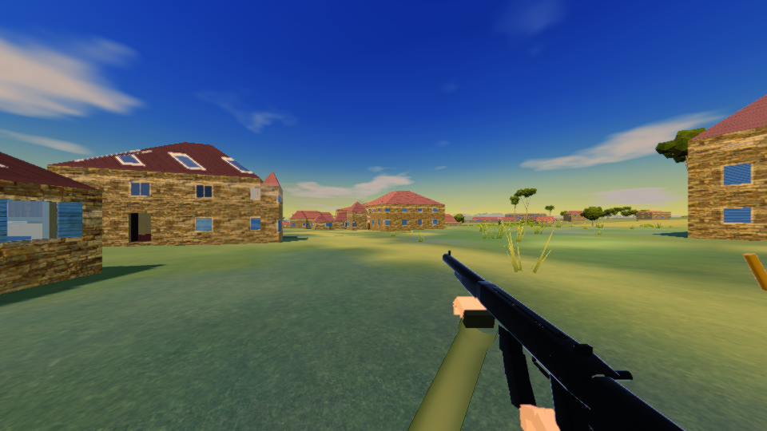
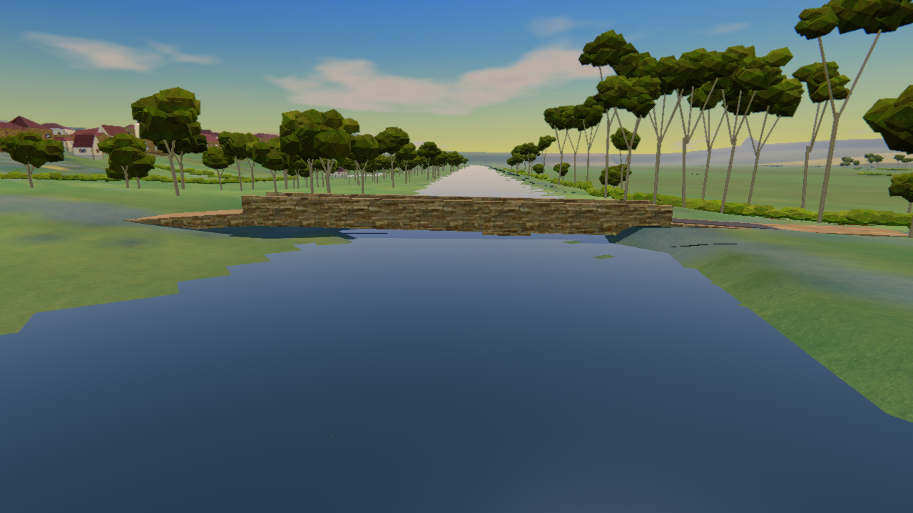
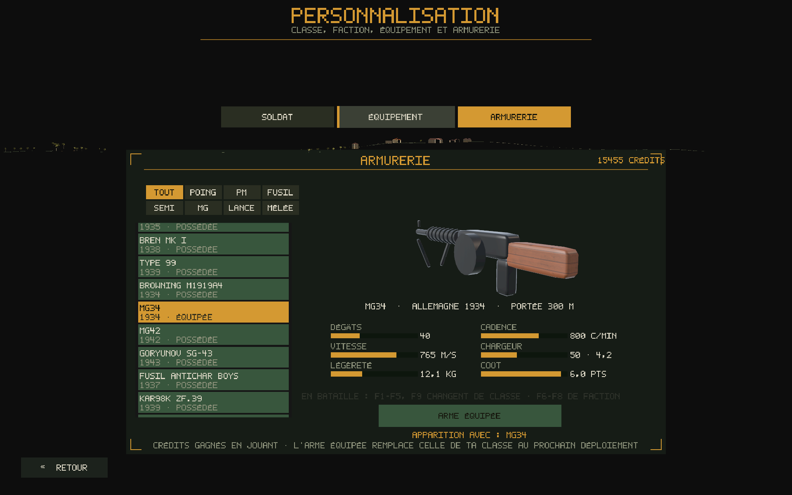

# Terre Brûlée

FPS tactique Seconde Guerre mondiale (Unity), fait par Paul avec Claude.
Bots en équipe, plusieurs factions et classes, armurerie, véhicules, et des cartes construites à partir de **vrais lieux** —
dont **Montigny-Mornay-Villeneuve-sur-Vingeanne** (Côte-d'Or) reconstitué d'après les données de l'IGN : relief au mètre,
bâtiments à leur emplacement et à leur hauteur réels, routes, ponts, rivière et canal.

## Jouer (Windows 64 bits)

1. Télécharger **TerreBrulee-Windows.zip** dans [Releases](../../releases/latest).
2. Décompresser, lancer `TerreBrulee/TerreBrulee.exe`.

## Images

| | |
|---|---|
|  |  |
|  |  |
|  |  |

## Sources des données

Relief, bâti, routes et photo aérienne : IGN (licence ouverte Etalab 2.0) · Cadastre (Etalab) · © contributeurs OpenStreetMap (ODbL) ·
textures Poly Haven (CC0) · musique MusicGen (CC-BY-NC 4.0) · bruitages BBC Sound Effects (licence RemArc, usage personnel et non commercial). Jeu gratuit, non commercial.

Voir [LICENSE](LICENSE) : tous droits réservés, copie et décompilation interdites.
